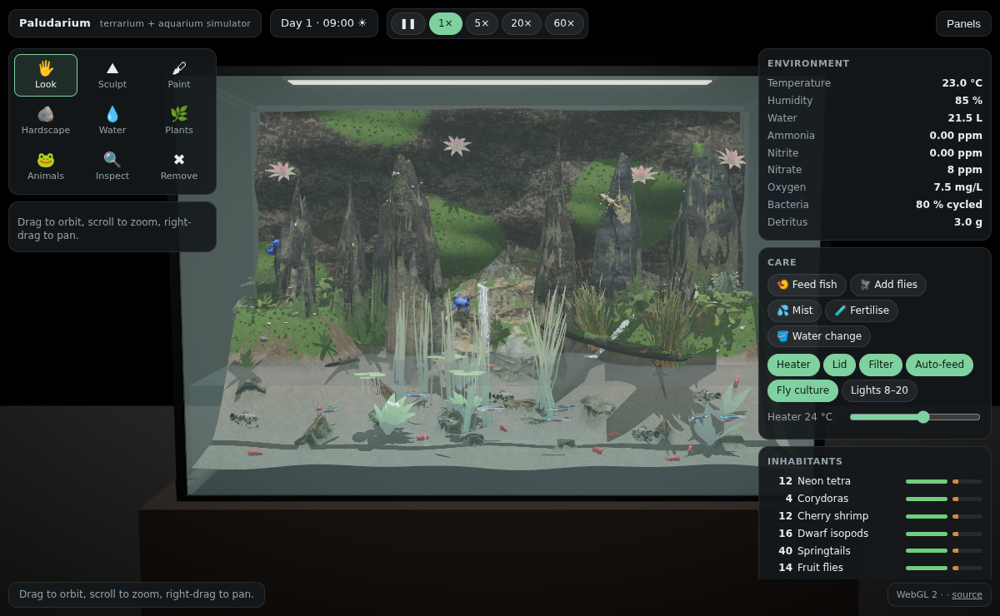

# Paludarium

**[▶ Play in your browser](https://raw.githack.com/pederotto/paludarium/main/index.html)**

Design a paludarium from scratch and watch it come alive. Shape the ground, stack and turn rocks into cliffs, dig pools and stream beds, and place the pump's outlets: the water really flows. The pump lifts water from the main pool, it fills the pools you dug, spills over their lowest lip, pours off ledges as waterfalls and runs down your channels back to the lagoon, and the total amount of water is conserved all the way. Then plant it and let it settle in over weeks, from raw water through brown diatoms and an algae phase to moss creeping over damp stone, before you stock it with frogs, fish, shrimp and insects. Each one has real needs. The tank has day and night, climate and a nitrogen cycle, and animals eat, breed and die.

Built with [three.js](https://threejs.org) on **WebGPU**, using three.js's shading language (TSL). It falls back to WebGL 2 automatically when WebGPU isn't available. It reuses open-source work wherever it can: photoscanned CC0 rocks, roots and ferns from Poly Haven, textures and a rock generator from SeedThree, the ripple, caustics and creature-meshing techniques of CAUSTIC//VOLUME, camera-controls for the camera and three-mesh-bvh for fast rock stamping (see [CREDITS.md](CREDITS.md)).



## ▶ Play

**[Open Paludarium in your browser](https://raw.githack.com/pederotto/paludarium/main/index.html)**. Nothing to install. It works best in a recent Chrome or Edge (WebGPU); other browsers fall back to WebGL 2.

## Playing

| Tool | What it does |
|---|---|
| **Look** | Drag to orbit, right-drag to pan, scroll to zoom toward the pointer. Double-click anything to fly to it. |
| **Sculpt** | Raise, lower, smooth or flatten the substrate *and* the background wall. The water follows the new shape while you sculpt. |
| **Paint** | Soil, sand, gravel, rock, moss or dark stone. Moss grows tufts, spreads where the air is damp and dies back where it's dry. |
| **Hardscape** | Click the ground to place mossy boulders, a cliff face, stone spires, roots, a stump or driftwood; click on top of a piece to stack another on it. Click a piece to select it, then drag the handles to **move** (G), **turn** (R) or **scale** (T) it; **Duplicate** (Ctrl+D), **Drop to ground**, **Level**, **Delete**. Stone is stamped into the ground, so water pools against it and pours off it, and animals climb it. |
| **Water** | **Channel**: drag a path and a stream bed is dug along it, always running downhill from where you started, with banks built up where it crosses a slope. **Pool**: dig a round pool with a raised lip. **Bank**: raise a ridge to hold water in or steer it. **Outlet**: place a pump outlet on the ground, a rock or the background; a blue line shows where its water will go and which hollows it will fill. **Fill**: fill a hollow now from the main pool. **Pump**: move the pump. Sliders set the main pool's level and the pump's flow; the panel shows where every litre is. |
| **Plants** | Land (lady fern, fern, creeping jenny, bilberry, grass), background (bromeliad, creeping fig), waterline (cattail, umbrella sedge), underwater (vallisneria, Amazon sword, Java fern), floating (frogbit, water lily). Grown plants spread. |
| **Animals** | Neon tetras, guppies, corydoras, cherry shrimp, vampire crabs, dwarf isopods, springtails, fruit flies, blue and strawberry dart frogs, fire-bellied toads, paddle-tail newts, axolotls, mourning geckos. |
| **Inspect** | Click an animal, plant or pool to see how it's doing. |
| **Remove** | Click a plant, animal, rock or outlet to remove it, or a pool to drain it into the main pool. |

Camera: the **Front / Top / Left / Right / Close** buttons fly to a view, <kbd>W</kbd><kbd>A</kbd><kbd>S</kbd><kbd>D</kbd> pan over the tank, <kbd>Q</kbd>/<kbd>E</kbd> or the arrow keys turn around it, <kbd>Z</kbd>/<kbd>X</kbd> zoom, <kbd>F</kbd> frames the selection. While editing, the left button uses the tool, the right button orbits and the middle button (or Shift + right) pans.

Other keys: <kbd>1</kbd>–<kbd>9</kbd> pick tools, <kbd>Ctrl</kbd>+<kbd>Z</kbd> undoes the last change to the ground, rocks or outlets, <kbd>Space</kbd> pauses, <kbd>Esc</kbd> deselects or returns to Look, <kbd>H</kbd> hides the panels. The tank autosaves to your browser every minute; **Export** and **Import** move it between machines as JSON. **New tank** starts from bare substrate; **Starter tank** loads the example layout.

## The simulation

One real second is one minute in the tank at 1× (a day takes 24 minutes). 5×, 20× and 60× speed it up.

- **Light.** Lights run 08:00–20:00 with a dawn and dusk ramp (or on or off). Plants need light, and caustics dance on everything under water while the lights are on.
- **Climate.** Temperature follows the room, the lamp, the lid and the heater. Humidity rises with open water, waterfalls, moss, plants, misting and a closed lid, and falls when the lid is open or the tank is hot.
- **Nitrogen cycle.** Fish waste and rotting food make ammonia. Bacteria colonise the tank over about five days and turn ammonia into nitrite, then nitrate. Plants and water changes remove nitrate. Waterfalls and the filter add oxygen; warm water and many fish use it up.
- **Life cycles.** Frogs, toads and newts lay egg clutches in or by the water; clutches hatch into tadpoles, which grow and climb out as young frogs or newts after about two weeks. Mourning geckos lay eggs on the background. Moss and litter give prey a refuge, so hunters can't eat the last few.
- **Food web.** Fish eat flakes (use **Feed fish** or the auto-feeder). Corydoras, shrimp, isopods and springtails eat detritus and biofilm. Dart frogs and toads hunt fruit flies, springtails and isopods (toads also take shrimp). Dead animals and plants become detritus, which the clean-up crew recycles.
- **Needs.** Every species has a temperature range, and land animals need a minimum humidity (dart frogs 75%+). Aquatic animals suffer from ammonia, nitrite, high nitrate and low oxygen; everyone suffers from hunger. Stressed animals lose health and recover when conditions improve. Guppies, shrimp, isopods, springtails and fruit flies breed when well fed and healthy, up to what the tank can hold.
- **Water.** The tank holds a fixed amount of water. The pump in the main pool lifts it to the outlets (it runs dry if the pool gets too low); from there it flows over the substrate, fills hollows up to their lowest lip, runs down channels and leaps off ledges as waterfalls, then drains back into the main pool, whose level drops by what the upper pools hold. Water evaporates (faster with the lid open and in dry air); the auto top-up replaces it. Ripples run across the main pool (waterfalls, animals and your clicks start them) and bounce off the glass, and the light they focus draws moving caustics on the bottom.
- **Settling in.** A new tank starts raw. Fresh substrate leaches ammonia and silicate for about three weeks: bacteria colonise on the ammonia, brown diatoms coat everything under water, and green algae take off if light and nutrients outrun the plants (more plants, floating cover, shorter light, water changes and grazers like shrimp and tadpoles push it back). Moss spreads over damp soil, stone and the background, most of all in the spray of waterfalls, and the hardscape greens over; grown plants put out runners and plantlets. The Environment panel shows the stage (New, Cycling, Algae bloom, Settling in, Established, Mature) and what to do about it.
- **Plants** grow when they have light, damp air (land plants) or nutrients (water plants), and spread once grown. Starved plants stall, and very poor conditions kill them.

## How it's built

```
index.html          UI, styles and the import map
src/main.js         WebGPU renderer, camera, lights, glass tank, frame loop
src/world.js        ties everything together; starter layout; save/load
src/terrain.js      substrate and background heightfields, sculpt and paint brushes
src/hydro.js        the water simulation: pump, main pool volume and level, flowing water (virtual pipes), falls, basins
src/water.js        drawing the water: main pool surface, pools and streams, waterfalls, pump and outlets, flow preview
src/decor.js        hardscape pieces (stamped into the ground, movable) and moss tufts
src/ecology.js      how the tank settles in: diatoms, algae, moss spreading, maturity stages
src/waterfx.js      ripple simulation, caustics and water surface shading
src/creatures.js    SDF animal bodies, surface nets mesher, animated instancing
src/mist.js         mist particles
src/plants.js       plant species, leaf-card and low-poly geometry, growth
src/animals.js      animal species, low-poly models, behaviours (schooling, crawling, hopping, hunting, flying)
src/sim.js          climate, water chemistry, food web, health, breeding
src/shaders.js      TSL: triplanar textured substrate, caustics, plant sway
src/ui.js           tools, rock handles, camera keys and views, undo, panels, input
assets/             textures (see CREDITS.md)
tools/              asset import script and headless browser tests
```

- **Substrate and background** are heightfields. Each vertex stores six material weights, and the shader blends six textures with triplanar projection, so steep banks and the vertical wall don't stretch.
- **Ripples and caustics** are ported from CAUSTIC//VOLUME: a wave-equation height field on the GPU, and a grid on the surface that casts refracted light rays onto the substrate, where the ratio of areas gives the brightness.
- **Animals** are signed distance functions meshed with surface nets (also from CAUSTIC//VOLUME), coloured per vertex and animated in the vertex shader: tails and bodies undulate, legs walk in a diagonal gait and frogs stretch their legs to hop.
- **Hardscape** is Poly Haven photoscans (plus procedural stone spires) with moss grown on their upper faces in the shader.
- **Water** has two parts. The main pool is every cell connected to the pump below its flat surface; its level comes from its volume through a priority flood from the pump (the lowest level at which the pool reaches each cell). Everything else flows with the "virtual pipes" shallow-water model (Mei, Decaudin and Hu, 2007): each cell keeps the flow through four pipes to its neighbours, driven by the difference in water height and scaled so no cell gives away more than it holds. Where the ground drops away steeply the water leaves the surface and lands at the foot of the drop; those lips are drawn as waterfalls that fly out in a real ballistic arc. Pools and streams are one mesh on the substrate grid, shaded with foam and streaks that move with the simulated flow (a two-phase flow map). The substrate under them is shaded as wet and submerged per vertex.
- **Looking into water**: light is absorbed on its way down from the lamp and again on its way to your eye, up to where the view ray leaves the water (the surface or the glass), and the water scatters its own colour into the view; algae and detritus make it thicker and greener. The main surface refracts what's behind it and reflects the dark room and the lamp. Ambient occlusion (three.js's GTAO) darkens crevices.
- **Hardscape** stamps sit on top of the sculpted ground (the two are kept apart), so pieces can be moved and removed at any time; three-mesh-bvh makes the ray casts fast enough to re-stamp a piece while you drag it.
- **Animals** are instanced: one draw call per species (plus one for fish tails, which wag). Fish school with separation, alignment and cohesion; crawlers pick targets on their preferred ground (land animals prefer moss and damp spots); frogs sit, hop in arcs and snap prey with their tongue.
- **Plants** are instanced per species. They sway with a `sway` vertex attribute, more under water.

## Running it locally

For development. There's no build step: it's plain ES modules plus an import map.

```bash
git clone https://github.com/pederotto/paludarium
cd paludarium
python3 -m http.server 8000     # or any static server
```

Open http://localhost:8000. The first load needs an internet connection for three.js, which comes from the jsDelivr CDN.

- `?webgl` forces the WebGL 2 back end.
- `?fresh` ignores the autosave and loads the starter tank.
- `?lowres` renders at 1× pixel ratio.
- `?ao` / `?noao` force ambient occlusion on or off (it's on by default with WebGPU).

## Tests

```bash
npm install
npm test            # loads the page headless (WebGL 2 via SwiftShader), fails on console errors, saves a screenshot
npm run test:sim    # fast-forwards 24 days and prints a daily ecosystem report (add &newtank to the query
                    # to watch a new tank cycle and settle)
npm run test:tools  # sculpts, digs and fills a pool, carves a channel, checks water is conserved, the pump,
                    # moving, stacking and duplicating rocks, undo, moss and plant spread, frogs, save/load
```

## Assets

Textures come from open-source projects; see [CREDITS.md](CREDITS.md). To refresh them from a SeedThree checkout:

```bash
git clone --depth 1 https://github.com/SkyeShark/SeedThree ../SeedThree
npm run import-assets -- ../SeedThree
```

## Ideas for next steps

- Caves and overhangs (a true 3D rock volume instead of a heightfield plus stamps), and water running behind rocks.
- Erosion and silt: fast streams carrying sand and dropping it in pools.
- Imported animal models where good open-licensed ones exist (for example CC-BY frogs from Sketchfab).
- Fireflies at night, a moonlight mode, a rain chamber.

## License

MIT; see [LICENSE](LICENSE). Third-party assets keep their own licenses (listed in CREDITS.md).
