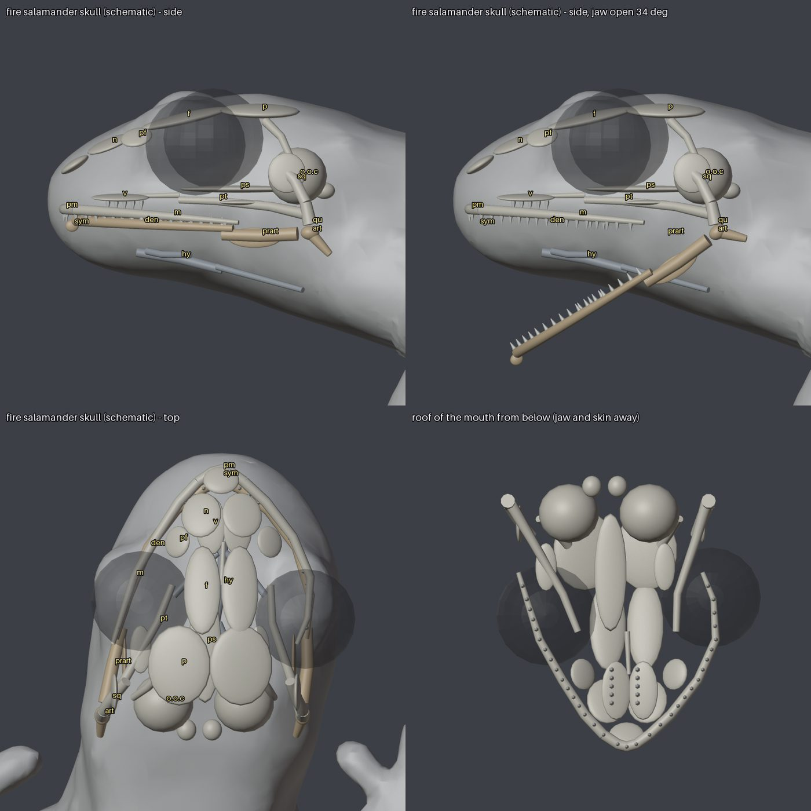

# Skeletons, muscles and turning

The rule for every animal (2026-10-03): an anatomical skeleton first (bones and joints from real anatomy or measured on the scan, the
skin bound to the bones, poses and gaits made by turning joints), then muscles (bulging and sliding as the joints bend), then skin.
This file is the audit of where each species stands, the shared framework (`src/util/bodyplan.js`, `src/util/turn.js`,
`tools/rig/skeleton.mjs`), how animals turn, and the measured plan for real skeletal animation in the engine.

## Audit (2026-10-04)

Rig types: **vertex rig** = the per-vertex rig of `render/creatures/instanced.js` (attribute `rig` = spine, leg id, legT, material;
legs shear forward and back, the body waves); **rig2** = plus the head/bend/tail channel; **baked rig** = the vertex rig's attribute
computed by a bake tool on a scan (`tools/rig/frog.mjs` thickness segmentation, `crab.mjs`, `shrimp.mjs`); **addRig** = guessed at
load (`glb.js addRig`); **skeleton** = bones measured on the scan, skinned by `tools/rig/skeleton.mjs` (bake time only so far).

| Species | Plan | Model, rig | Walk | Turn (new) | Hop / jump | Swim | Climb | Muscles |
|---|---|---|---|---|---|---|---|---|
| dart frogs (4 morphs), strawberry, leucomelas, auratus, bumblebee, reed frog, toad | anuran | scan GLB, baked vertex rig (far); **skeleton (17 bones) measured on the scan, skinned near the camera (runtime)**; swim-pose GLB | near: the legs turn at hip and shoulder, the knee, heel and elbow bend (skeleton); far: diagonal legs sweep (shear) | pivot on the hips, legs swing round the pivot (turnSweep, tau in anim.y); the swim body's trunk bends through the pose channels (stroke.trunk: spine and head yaw, pitch, twist; stroke.roll; 12-number armA), only when a caller passes them | near: hip, knee and heel extend until the leg trails behind; far: vertex shift (`hopLegs`) | pose model + kick cycle | reed frog: body on the stem/glass normal + gait | throat as a normal bulge; near: thigh, calf and shoulder swell with their joints |
| red-eyed tree frog | anuran | scan GLB, baked rig with hind-leg skeleton chain; **skeleton (17 bones)** for the baked `sleep` pose (not skinned at run time yet, see below) | far-style shear at every distance | as above | vertex shift | pose model | perch route, body on the leaf/glass | throat; **the sleep pose baked with muscles** (thighs, calves, shoulders); joint limits checked on it |
| paddle-tail newt, marbled newt, axolotl | caudate | SDF body, vertex rig + rig2 | trot + S-wave + head counter-swing | pivot on the hips, legs round the pivot (tau in rig2 A), C-bend into the turn, head leads, tail lags | none | legs swung back about shoulder and hip onto the flanks (75 / 85 degrees, length kept, feet at flank height) and one travelling wave along the whole body (wavelength 0.9 body, amplitude from 0 at the snout to the tail tip): `swimmer` in render/creatures/instanced.js (2026-10-04; before, the legs stuck out sideways and only the tail wagged); turns by the C-bend | none | throat pumping |
| fire salamander (rebuilt 6 Oct 2026) | caudate | scan GLB, **baked lizard rig: 21 bones + a `jaw` (22), four-bone skin, measured on the scan** (`tools/bake-lizard.mjs firesal`); a skull and mandible scheme under its mouth (see "Skulls and mandibles") | lateral sequence (`GAIT.firesal`: 2.95 s cycle, stride 0.5 body lengths, stance slip 0.05 cm a frame) | as the lizards | none | still the newt's whole-body wave (the real one is tail-led: open) | none | generic lizard layer + guesses; throat |
| mourning gecko | lizard | SDF body, vertex rig + rig2 (tail drop, stump) | trot + wave | as newt (lizard limits: more neck, faster stepping) | none | none | on the background: body on the wall normal, gait; yaw in the wall plane (no pivot shift there) | none |
| crocodile skink | lizard | SDF body, vertex rig + **rig2 (new)** | wave + legs | pivot on the hips, legs round it, C-bend, head leads (its look-round is now the head, not the body) | none | none | none | none |
| neon, cardinal, ember, guppy, betta, cory, oto, celestial pearl danio, tadpole; pygmy sunfish, clown loach (GLB, addRig) | fish | SDF (or GLB + addRig), vertex rig + **rig2 bend (new)** | body wave | swings round an arc (`steerLimit`), yaw rate capped (5 rad/s, 9 darting), C-bend from the yaw rate | none | body wave | none | none |
| cherry / blue dream shrimp | decapod | scan GLB, baked rig (16 leg ids: walking legs, pincers, swimmerets, antennae) | legs in two shuffled groups | legs step through the turn (gait driven by the turn), rate-limited | tail flick (curl) | swimmerets | none | none |
| vampire crab, panther crab | decapod | scan GLB, baked rig, sideways legs | sideways scuttle | legs step through the turn (calm lifted while turning), pivot on the middle | none | (aquatic panther walks) | burrow digging | none |
| isopods (3), springtails (3), fruit fly, cricket, dubia | arthropod | procedural invert rig (leg waves, antennae, wings, furcula, curl) | leg wave | legs step through the turn | furcula / cricket legs / flutter (the take-off yaw is still instant: an insect leaping) | none | none | none |
| earthworm, waxworm, maggot, pupa, trumpet snail | soft | procedural, body wave or rigid | wave / glide | rate-limited (a snail turns at 0.8 rad/s) | none | none | none | none |

What is still not anatomical: far from the camera, and for every animal but the frogs of the dart-frog scan, the walking legs are a
shear of the leg vertices and the hop a vertex shift; the red-eyed frog, the salamanders, newts, geckos, the skink and the fish have
no runtime skeleton yet (see "Runtime skinning" below for why the red-eye waits).

## The framework

* **Body plans** (`src/util/bodyplan.js`): `anuran`, `caudate`, `lizard`, `fish`, `decapod`, `arthropod`, `soft`; `planOf(species)`.
  Each has
  * `joints`: the range of every bone of the skeleton tool against its parent (degrees between them, 0 straight, 180 folded back):
    an anuran's knee and ankle fold to 175, its head turns at most 30 against the trunk; a salamander's trunk bends 60, its neck 40.
  * `rig`: the same limits as the game's channels see them: head yaw, C-bend, tail swing. `limitRig()` clamps what the mind, the
    gait and a turn ask for together, so nothing turns a neck further than the animal has one (a frog: 10 degrees).
  * `muscles`: bellies on bones that swell as a named joint bends (thigh with the knee, calf with the ankle, deltoid, epaxials,
    throat), `muscleBulge()`.
  * `turn`: the pivot (`hips`, `centre`, `none`), the fastest stepping in a turn, and how much of the rig range a turn uses.
* **Bake** (`tools/rig/skeleton.mjs`): `poseMatrices(bones, pose, { plan })` keeps every joint inside its range (a target past
  it is brought back in the plane of the bone and its parent; `clamped` lists them); `poseAngles()` reads a pose's joint bends;
  `applyMuscles()` swells the posed skin along its normals. `tools/bake-creature.mjs` passes the job's plan (`skeleton.plan`, an
  anuran for frog bones) and applies muscles when the job says `muscles: true` (off until checked in the bench). tests/turn.test.mjs checks the red-eyed frog's scan pose and sleep pose
  against the anuran ranges (all inside) and that a head turned over the shoulder is clamped.
* **Runtime**: the turning code below, and `limitRig` on every rig2 animal's head, bend and tail each frame.

## Turning

User report: animals "turn around their axle with no anatomic movement but just floating". Causes found:
1. every walker yawed about its middle at a fixed rate (3.2 rad/s), the feet sweeping back along the body as if walking, so planted
   feet slid 3.4 to 5.6 cm per radian; 2. fish and newts set yaw straight from velocity: a reversal flipped them 180 degrees in one
   step (up to 78 rad/s); 3. the look-round twitch (`vis`) rotated the whole body by up to 0.85 rad with no step at all, and the
   salamanders' nosing swung the whole body by 0.55 rad; 4. shrimp, crabs and bugs turned with their legs still.

Now (`src/util/turn.js`, `Animals.turnTo / turnPoseStep`, the shader's `turnSweep`):
* **Rate from the legs**: the fastest yaw is the yaw per leg cycle (4 x the leg sweep / the farthest foot's distance from the pivot,
  measured on the mesh: `limbFrame`) times the plan's fastest stepping. Dart frog 1.6 rad/s, toad 2.0, newt 1.5, gecko 4.1. Turns
  ease in (acceleration limit) and stop on the heading.
* **Pivot on the support**: on the ground the body turns about the hips (`pivotShift`), which stay where they are; the frog's planned
  leap or walk is carried with the body so it still goes straight ahead.
* **Legs**: every bit of turning drives the leg cycle (`turnSteps`), and the turning mix tau tells the vertex shader to swing the
  legs round the pivot instead of back along the body (`footRig` is the same formula), so a planted foot stays put. Small turns
  blend with walking by the mix.
* **Spine**: the C-bend into the turn, the head leading into it, the tail lagging (0.35 s) and swinging back after (`turnPose`),
  within the plan's joint limits; frogs do not bend.
* **Looking round**: an animal with a neck turns its head (the twitch and the nosing go to the head channel); one without (frogs,
  crabs, bugs) turns on the spot to look, stepping (`a.lookTo`).
* **Swimmers**: the wanted direction is held within 1.2 rad of the heading (1.6 for a salamander steered by its mind), so a fish
  swings round an arc, its yaw rate is capped and its body bends into the turn.

Measured (`node tools/steps/turn.mjs`, starter tank, baseline 10825ec vs this change; forced half turns on open ground):

| | before | after |
|---|---|---|
| foot slip per half turn, dart frog / toad / red-eye (on the spot) | 11.3 / 11.4 / 12.0 cm | 1.2 / 1.4 / 3.0 cm |
| foot slip, newt / gecko (turn to a goal behind and walk off) | 15.9 / 12.8 cm | 3.5 / 1.1 cm (fire salamander 3.6 to 11.3: its walk-off slides round obstacles) |
| yaw with the legs still in a forced turn | 0.10 to 0.13 rad (frogs) | 0 to 0.03 rad |
| fastest yaw in the tank, 40 s: neon / cory / newt | 77 / 75 / 79 rad/s | 5.4 / 5 / 2.2 rad/s |
| shrimp: share of turning with the legs still | 56 % | 10 % |
| fish / newt / gecko: share of turning without a bend into it | 100 / 100 / 19 % | 9-13 / 1 / 11 % |
| the look-round twitch | whole body spun by up to 0.85 rad | head (rig2), or a stepped turn |

Left as they are: the take-off yaw of jumping and flying insects and the shrimp's tail-flick escape (a leap, not a turn), and the
unstick in `keepFree` (`a.yaw = ang`, about 2 fish in 40 s; containment code, flagged to that owner).

Frame cost: same pipeline count (142 to 145 builds either way). Steady frame time ABBA inconclusive on a loaded machine (WebGPU gfx
18.5 / 23.8 ms baseline vs 22.1 ms; WebGL 24.3 / 24.4 vs 24.2 ms). The first load of the changed shaders is slower once (Metal
compiles the new variants, then caches them).

## Runtime skeletons: the prototype and the decision

`src/bench/skinproto.js` (bench.html?proto=skin|rig, measured by `node tools/skin-proto.mjs`): N dart frogs skinned per instance
from a bone texture (15 bones in a hierarchy composed on the CPU each frame, one texture row per instance; 4 bones per vertex, the
vertex's bone ids and weights read from a per-vertex data texture by vertex index, because the creature pipelines already use the 8
vertex buffers WebGPU allows), against the game's own rig material, same shading, frames uncapped, A B B A. M1, 2026-10-04:

| setting | rig | bone-texture skin | extra |
|---|---|---|---|
| WebGPU, 100 x 6.9k verts | 3.9 ms | 7.6 ms (CPU 0.42 ms) | 2.4 ns a vertex (with the shadow pass) |
| WebGPU, 400 x 6.9k | 10.3 ms | 21.2 ms (CPU 1.66 ms) | 3.9 ns |
| WebGPU, 400 x 15k (fine mesh) | 17.5 ms | 49.3 ms | 5.3 ns |
| WebGL 2, 100 x 6.9k | 3.1 ms | 8.6 ms | 7.9 ns |
| WebGL 2, 400 x 6.9k | 7.0 ms | 25.7 ms | 6.7 ns |

The starter tank draws 376k creature vertices, of which 59k are four-legged vertebrates (frogs, newts, gecko); the swarms
(springtails 106k, flies 84k, isopods 38k, shrimp 51k) are most of the rest. **Decision**: per-instance skinning is affordable for the
vertebrates only: about +0.25 ms (WebGPU) / +0.4 ms (WebGL) of GPU and +0.05 ms of CPU on the M1 for the starter tank, roughly three
times that on the Snapdragon laptop. Not for the invertebrate swarms, which keep the vertex rig. It is about twice the rig's vertex
cost, so the engine version should halve it: 2 bones a vertex (enough for limbs), bones as 3 texels (affine 3x4), the skin data in one
texel, and only the fine (near) LOD skinned.

## Runtime skinning (phase 3, 2026-10-04)

The frogs of the dart-frog scan (dartfrog and its morphs, leucomelas, strawberry, auratus, bumblebee, reed frog, toad) are drawn by
their skeleton within `near` cm of the camera; farther away, and with the switch off, the vertex rig draws them as before.

* **Skeleton** (`tools/bake-creature.mjs` FROG_SKELETON): joints measured on the scan with `tools/rig/joints-view.mjs` (top, side and
  front views in the rig's frame, coloured by the bone each vertex is bound to): the hind leg folded in a Z (thigh forward and out to
  the knee at the front of the lobe, shin back to the heel at its rear tip, foot forward along the ground), the arm straight down
  with the elbow back. Each species' warp carries the joints with the skin (`carryJoints`); the manifest holds the skeleton in cm.
* **Binding** (`bindCapsules`): two bones a vertex, each bone a capsule (`radius`); the second bone is always across a joint from the
  first (or a limb's root and a body bone), the weights smoothed over the mesh (6 passes), and the hand or foot past the middle of
  the limb only on its own bones (a sitting frog's toes lie under its thigh). Written as `_SKIN` into the detailed file only.
* **Pose** (`src/render/creatures/skeleton.js`, per instance on the CPU): the toe tip goes where the rig would put it (gait, turn, swim
  pose). A hind leg turns about the hip as a whole and opens or closes its fold, knee and heel together, for the reach (two-bone IK
  over thigh and shin is useless on a Z-folded leg: the heel sits so close to the hip that a 3 mm step swung the knee 7 mm); walking,
  the hind feet are set a sweep further out than when sitting, because the scan's knee is already at 156 of its 175 degrees. The
  forelegs reach by two-bone IK with the hand laid down and yawed with the turn. A hop extends hip, knee and heel until the leg trails
  behind (85 % of its length). Knee, elbow, heel and wrist are kept inside the anuran ranges. Muscles: the plan's thigh, calf and
  shoulder bellies as a radial scale of the bone with the joint's flexion against the rest pose (no shader cost).
* **GPU** (`src/render/creatures/skin.js`): bones as 3 texels (affine 3x4) in one shared float texture, 64 x 64 texels (64 instances,
  at most `SKIN.cap` = 8 of a species: more of it near the camera fall back to the rig); an instance's row rides in anim.y; the skin
  attribute interleaved with `rig` in one vertex buffer (WebGPU's 8 a pipeline); the normal skinned too (a varying for the shading).
  One more material per skinned species (its near mesh), built while the tank loads.
* **Switch**: `?noskin`; off on the Low preset and on WEAK_GPU adapters (`engine/gfx.js`).

Measured (M1, other agents running):

| | rig | skinned |
|---|---|---|
| bench, 48 dart frogs x 15k verts, WebGPU (`node tools/skin-proto.mjs --n=48 --lod=hi --b=engine`) | 4.40 ms | 5.07 ms (+0.9 ns a vertex; CPU 8 us an instance) |
| same, WebGL 2 | 3.59 ms | 6.37 ms (+3.9 ns a vertex) |
| skin stretched past 2x in a walk / hop, dart frog (`node tools/rig/skin-stretch.mjs`) | 0.2 % / 2.8 % of triangles | 1.5 % / 8.0 % (the knee and hip creases; the hop's thigh parting from the flank the scan fused) |

In the starter tank 3 or 4 frogs are near the camera in a close view (60k vertices: about +0.05 ms WebGPU, +0.2 ms WebGL by the bench's
per-vertex cost); the in-game A B B A (`node tools/steps/skin-perf.mjs`) was inconclusive on the loaded machine.

Not yet: the **red-eyed frog** (its hind legs lie folded flat, thigh and shin fused in one lobe, the long toes beside the hands:
walking on its joints tore the lobe and left toe tips behind, 2.7 % of triangles past 2x in a walk, 11 % in a hop; the joints need
measuring again with the lobe split), the **fire salamander** (the scan has no baked rig to bind against; caudate plans need spine
and tail bones driven by the rig2 channels), the SDF bodies (newts, axolotl, gecko, skink: no scan to bind), the fish.

## Swimming blueprint (frogs and toads, 2026-10-04)

User report: frogs in the water "just float and twitch instead of interacting with water and moving naturally", then, of the first
fix, "the kick goes in a crazy direction". Two causes. The motion: the legs slid straight back and forth in a fixed V, which is not
how a frog swims. The body: the sitting scan's hind legs are one folded lump (thigh, shin and foot fused), so any pose that stretches
them smears the skin into ribbons, whatever the bones do. Now every frog and toad swims with ONE system, in two layers, in a body made
for it, and a new frog plugs in by adding its profile and its swimming body.

**The swimming body** (`<id>.swim.glb`, tools/bake-frogpose.mjs): the frog scanned mid-stroke (art-src/raw/frog_swim_mesh.glb), its
four limbs apart and half bent, which is the pose a skeleton binds best in. The bake measures its skeleton on the scan
(`SWIM_SKELETON`: the same 17 bones as the sitting frog's, tools/rig/skeleton.mjs frogBones), binds the skin (bindCapsules, `_SKIN`)
and writes the skeleton to the manifest with `bind: 'swim'`. Painted by the species' own painter, so it matches the sitting body.

**Motion layer** (pure, `src/util/gait.js`, tests/swim.test.mjs):
* the **stroke as joint angles**, read off film of swimming frogs from above (the user's references) and the four beats of the "frog
  kick": `HIND` key poses (cocked: thighs forward beside the flanks, feet turned out; kick: the feet sweep out and back; open: legs
  straight in a V; glide: legs together, toes pointed; draw: knees out, shins angled back in, a diamond from above; turn: feet turning
  out) joined by a curve that passes through each without overshoot (`STROKE_KEYS`, `strokeAngles(p, out, o, amp, float)`); the
  forelegs laid back as it drives and held out as it draws its legs up (`FORE`, `armAngles`, `armOpen`). A segment's direction is two
  angles in the frog's own frame (from straight back round to forward, and up or down), so the same numbers pose any frog's bones.
* inputs: the species' **SWIM profile** (`src/util/bodyplan.js SWIM`: kick rate `kickHz` [pottering, urgent], `reach` (body lengths a
  kick), `burst` and `rest` (weak swimmers kick in short bursts and rest with the legs trailing), `drag`, `headUp`, `hang` and `float`
  (rests at the surface, hanging from its nostrils: the fire-bellied toad), `arms` (how far the forelegs are held out)); the body's
  length; from the behaviour layer urgency (0 pottering … 1 a dash for the way out), floating, and `steer`.
* `swimStep(state, profile, { urgency, floating, steer, bodyLen }, dt)`: the stroke clock (phase in kicks), bursts and rests; both
  legs together when it means to get somewhere, one after the other when it potters (`alt`), the inner leg of a turn trailing
  (`steer`); returns the speed in cm/s: a surge as the legs drive, a glide that decays, `reach` body lengths a kick.
* `swimPose(state, profile, { level, t })`: `stroke` for the skeleton ({ pL, pR, ampL, ampR, float, scull, arms }), the body's
  `pitch` / `roll` / `yaw` (level at the surface with the nose up, lifting as the legs drive; hanging when it floats; swinging a little
  when it kicks one leg at a time), and `hop` for the rig of a body without bones.
* `leapStroke(t)`: a **leap** by the same body (below).

**Render layer**: `render/creatures/skeleton.js poseStroke(rig, stroke, …)` points every limb bone by its angles from the limb's root
outward (forward kinematics: lengths kept, each bone keeping the side it turns to the frog's back, the foot rolling from web-upright
as it pushes to flat as it trails); muscles swell as in poseBones. `CreatureMesh.put(…, stroke)` → `CreatureLOD.put(…, stroke)`. The
swimming body is drawn by its bones at any distance and on every preset (`SKIN.swim`, off only with `?noskin`): there are never more
than a few frogs in the water, and without bones it is one frozen pose.

**Behaviour layer** (`src/sim/animals.js`): `frog()` decides it is in the water, `frogSwim()` where to (the nearest way out: a bank
to hop onto (`shoreLand`), a steep bank to climb (`exitClimb`), the glass for a frog with toe pads (`exitGlass`); a toad may float or
potter instead), how urgent and which way to steer; `swimClock()` runs the motion layer and moves the frog by its speed along its
heading (turns through `turnTo`); `swimDepth()` puts its back awash and its eyes out (from the swimming body's spine); `swimWake()`
and the kick ring disturb the water. Avoidance (`tooDeep`): a frog is not pushed or slid into water deeper than half its body.
The way out (2026-10-04) is looked for along 32 lines across the whole pool (it used to be 16 lines, 30 cm out, and a random 5-11 cm
roam when that found nothing: a bumblebee toad in the middle of a big lagoon zigzagged for up to a minute and a half); a way out once
found is kept unless a nearer one turns up; with none in sight it swims to the nearest bank and along it (each stretch tried counts
as no good); a root or rock in the way is slid along, and only blamed when the frog faces its goal and nothing near that way is
clear (a frog pressed against a sunken root used to blame every way out it thought of, until it had none and paddled on the spot).
Measured with `tools/steps/frog-water.mjs` (11 tanks; before: 2 runs, 400 drops a species; after: 3 runs, 600): bumblebee toad
dropped in deep water out in median 3.3 s, p95 15 s, over 30 s 1 % of drops, longest 74 s (was 3.6 / 28 s, 4 %, 99 s); in the water
at most 1.2 % of the time in a tank (one run 3.6 %; the real animal: about never). Yellow-banded poison frog: median 2.2 s, p95 8.7 s,
over 30 s 1 %, trapped 1 of 600 (was 2.3 / 21.5 s, 2.5 %, 3 of 400); in the water at most 2.3 % (karst; target 0-2 %). What is left
is distance (a bumblebee toad paddles about 2.3 cm/s, and the big lagoons are 40 cm across) and the karst tank's pools, boxed in by
rock pieces, which `exitClimb` will not climb (it refuses any path through a piece in the occupancy grid): a frog with toe pads
should climb rough rock out of the water.

**Under the water** (a frog at home in it: SWIM `dive`, the fire-bellied toad): `frogDive()` tips its nose down and kicks to the
bottom (or onto a sunken branch or stone), sits there as it sits on land (`sitting` → the stroke's `sit`: legs folded, hands down),
then pushes off and kicks up to the surface, where it rests hanging from its nostrils. Seen in the owner's films: a leopard frog in a
basin sitting on the bottom and pushing off, a frog in a pool swimming well under the surface. A toad stays in the water for minutes
(`wetStay`), resting most of that time, pottering and now and then diving; on land it makes for water again after a while
(`frogPlan`: `pond`). The poison frogs, the bumblebee toad and the reed frog only cross water; the red-eyed tree frog never enters it.

**Riding the water** (2026-10-04): a frog or toad at the surface (and a newt or axolotl that has come up) rides the drawn surface:
`WaterFX.probe` works out, in a one-pixel-a-body pass after the ripple step, the surface's height under it (the ripples and the small
travelling waves, averaged over its footprint, and the slope across it) and reads it back to the CPU without stalling (one reading
in flight; 60 readings a second on WebGPU, 30 on WebGL 2 on the M1, no frame cost measured); `Animals.ride` eases the body up and down
and tips it with the slope. The old made-up swell (`bob`) is gone: on still water a floating frog lies still, as a real one does;
the kick's own dip stays (`kickHeave`). Riding moves no water: the body's spheres go to the ripple pass where it would be on still
water, or it would feed its own bobbing. `node tools/steps/ride-probe.mjs` sets the ride against the field under the toad.

**The water it moves** (`render/waterfx.js` hulls, after CAUSTIC//VOLUME's sandbox): a swimming frog is its skeleton to the water: a
sphere at its trunk's three bones and at the end of every limb bone (`poseStroke` `hull`, 17 of them, a foot counted wider than its
bone: the web), handed to `WaterFX.addHull` each frame by `Animals.draw`. The ripple pass takes, for each sphere, the column of water it
occupies where it is now from the column it occupied a step ago, and changes the height field by the difference: the body's surge
leaves a bow and a wake, each foot's sweep its own ring, a frog dropping in a splash, with no drops placed by hand. Every other animal
in or at the water (a wading newt, a fish at the surface, a crab) is one sphere (`Animals.hulls`). A body well under the surface
moves none. The pass costs the same with 48 spheres as with none (measured, 1.6 ms a step either way on the M1).

**The leap**: a frog in the air is drawn in the same body (`leapStroke`: legs driven from cocked to straight, hips and knees before
ankles and feet, the order measured for a frog's take-off (Biomimetics 9(3):168, 2024, the user's reference); trailing through the
flight; folded before the landing; the forelegs drawn back under the chest, then reaching forward and down to land on). The sitting
body is drawn on the ground before and after. This replaces the sitting skeleton's hop, whose skin stretched about threefold.

**Open (noted by the owner, 2026-10-04)**: the swimming body has no webbing between its toes. A swimming frog's foot is a paddle:
the web spreads as the foot drives back and folds as it trails. Built and parked on the local branch `feat/webbing` (on top of
`feat/water2`), not shipped: a see-through membrane between the hind toes out to near the tips for the fire-bellied toad, the red-eyed
tree frog and the reed frog (tools/bake-frogpose.mjs `hindToes`, `webSheet`; faded with the legs' extension, render/creatures/
instanced.js `webFold`), waiting for the owner's verdict on its third pass (the first, opaque and reaching half to three quarters
out, "looks like handicaps; webbing is translucent, fills all the space between fingers"). Until then the foot's hull sphere stands
in for the web in the water coupling (`poseStroke` hull: a foot counts 2.2 times its bone's width).

**Adding a frog**: a job in tools/bake-frogpose.mjs (size, painter, eyes: `node tools/bake-frogpose.mjs <id>.swim`), a SWIM row in
bodyplan.js (copy the nearest species, then set kick rate and reach from its biology: a weak swimmer 0.4-0.5 body lengths a kick, a
strong one 0.8), then `node --test tests/swim.test.mjs`, `node tools/steps/swim-cycle.mjs --ids=<id>` (the stroke from above, the
side and three-quarter, to hold against film of the real animal), `tools/steps/swim-film.mjs` and `tools/steps/leap-film.mjs` (in a
tank) and `tools/steps/frog-water.mjs` (time in the water, exits). A frog with a body of another build (the red-eyed tree frog)
needs its own swimming scan and `SWIM_SKELETON` for a body true to its proportions; the red-eyed tree frog, which does not swim, has
the shared body painted as itself (`redeye.swim`) to leap in.

## Skulls and mandibles: the mouth rule (owner, 6 Oct 2026)

The owner, with a labelled plate of an amphibian skull (dorsal, ventral, side, back and front views of the cranium, and the lower jaw's dentary, prearticular and
articular): "skull and mandible should schematically and conceptually follow this to have some realism ... generalise the rule and approach for future mouths."
It is the skeleton-first rule (the rule at the top of this file) applied to the head: **a mouth is built on a skull and a mandible, not cut into a smooth head.**

The rule, for every animal with a mouth:
- The animal gets a SKULL and a MANDIBLE first: schematic, but the real bones in their real places and relations, fitted inside its own head surface.
- The **lip line is the tooth line**: premaxilla and maxilla above, dentary below, their tooth rows meeting on one surface (the lip surface).
- The **jaw hinge is the quadrate-articular joint**, one each side, on one transverse axis: the jaw bone's pivot is that axis, nothing else.
- The **lower jaw is one rigid piece of bones** (dentary, angular/prearticular, articular with its retroarticular process, the symphysis); it turns about the hinge.
- The **roof of the mouth is the palate bones** (vomer, pterygoid, parasphenoid) and the **cavity is the space between that roof and the mandible's rami**.
- The **eyes sit in the orbits** (open between prefrontal, frontal, squamosal and maxilla), the braincase (otic-occipital) is the back wall; no bone in an eyeball.
- Every bone lies **inside the skin with a margin**, and so does the mouth's cavity (a red patch once came through the neck; it turned out to be a texture flip, but the check stays).
- Muscles come next and attach to these bones (the depressor mandibulae to the retroarticular process, the adductors from the squamosal and parietal to the dentary), then skin.

How (tools): `tools/rig/skull.mjs` holds the class plans as FRACTIONS (along the skull, across it, up it) so one plan fits every species of the class: `caudate`
(salamanders and newts: fused premaxilla, nasals, prefrontals, paired frontals and parietals, a short maxilla ending under the orbit, squamosal-quadrate suspension, pterygoid,
vomer with the tooth rows, no palatine, a stout hyobranchial skeleton) and `anuran` (the plate's own frog skull: 33 bones once paired; broad and flat, a long toothed maxilla to the quadratojugal, one frontoparietal roof plate, a three-armed pterygoid, a toothless dentary; fitted to the sculpted slim swimming scan of the European edible and common frogs, `art-src/skull/frog.skull.json`, lab head only until a frog body is baked: its tongue and the palate that dips round the eyeballs are cut by the lab's `frog-mouth.py`, the sculpt by `frog-sculpt.py`, both in `.agents/skin/skull`). `node tools/rig/skull.mjs <id> <head.glb>`
measures the head (lip-level outline, roof and underside along the middle, despiked), fits the plan and writes `art-src/skull/<id>.skull.json` (cm, baked frame: bones as rods and
ellipsoids, the hinge pair, tooth rows, the checks). `Blender -b -P tools/blender/skull.py -- <json> <head-without-mouth.glb> <prefix> --mouth <head-with-mouth.glb>` builds the
meshes with the lower jaw on a pivot at the hinge, checks every bone against the skin (closest-point sign test), the eyeballs and the mouth cavity, writes the result back as
`verified` (a JSON with `eyeZone`, the frogs', leaves the faces within that many eye radii out of the containment test, because the scan's eyeballs are spheres merged into the skin whose sheets fool a closest-point sign test, and judges the cavity vertices under a globe against the globe), and renders x-rays (`python3 tools/skull-label.py` lays them out with the plate's codes: `docs/firesal-skull.jpg`). `tests/skull.test.mjs` keeps the plan complete
(the plate's codes), the tooth rows on the lip surface, the hinge on one axis and equal to the mouth script's and the jaw bone's, and the Blender check green.
For a NEW animal the order is: measure the head, fit the skull, check it in Blender, THEN cut the mouth from it (lip surface and hinge read from the skull JSON), then the
muscles. (For the fire salamander the mouth was cut first from the scan's head, so the skull was fitted to its lip surface and hinge, and the test makes them agree.)

Fire salamander (16 cm animal), 6 Oct: 30 bones in 15 kinds, skull 2.25 cm long and 1.68 cm wide at the quadrates (ratio 0.75; a broad salamander skull), the hinge on the
lip surface 5.8 cm behind the middle of the length, 7 tooth rows (premaxilla and maxillae above, dentaries below, a row on each vomer), the hyobranchial rods under the
floor. Blender check: all bones inside the skin (smallest margin 0.045 cm), none in the eyes, the 1,415 cavity vertices inside. The mouth was cut first, so the cavity was then FITTED to the
skull (`skull.py --fit-cavity`, positions only): before, 16 roof and 52 floor vertices lay inside palate bones, rami or the hyoid (up to 0.36 cm); after, the roof follows the palate
bones' underside where it runs under one (0.04 cm of mucosa), the hyoid sits lower, and 1 and 14 vertices graze a bone by at most 0.03 cm. The skin got a fine lip line (a groove
along the lip surface in the normal map, tools/skin/firesal-skin.py). The proportions are SCHEMATIC (a guess to the plate and the literature, tagged in the JSON), not measured on a
specimen; a CT of the species would replace them. The mouth is dressed on the skull (`skull.py --fit-cavity`, then `sh tools/rig/firesal-skin-chain.sh`): 113 tiny teeth (53 upper, 46 lower, 14 vomerine; 0.04-0.08 cm cones standing on
the cavity sheets, new vertices carrying the weights of their own sheet so the lower teeth turn with the jaw), a trough in the floor and a tongue pad of its own (81 vertices, an
ellipse on the floor), and a skin cover: gum pink at the tooth roots turning to ivory enamel (all teeth share one strip of the atlas), a pink-red palate, a darker floor, a paler tongue with
papillae in the normal map. The low level of detail has no teeth. Open: the muscles are not attached to the bones, the hyoid does not drive the throat pump yet, the tongue does not project. Next animals: frogs (plate's anuran plan, maxillary teeth, no dentary teeth, a long
maxilla to the quadratojugal), lizards (kinetic skulls: a mesokinetic hinge in the roof), fishes (the opercular series and the premaxillary protrusion).

## Phased plan

1. **Done (this pass)**: body plans with joint limits and muscles; limits enforced at bake (`poseMatrices`) and at runtime
   (`limitRig`); turning by the legs about the pivot with the spine bending, for every walker and swimmer; probes and tests.
2. **Skeletons for every vertebrate scan** (dart-frog scan, red-eye and fire salamander done; fish open): measure joints on each scan the way the red-eyed frog was (`.tmp-re/joints.mjs`,
   posepreview), store them in the bake jobs, bind with `bindSkin`; bake the pose library from joint angles (sleep, swim, crouch,
   turn-lean, call) with `{ plan }` limits and `applyMuscles`, checked in the bench. No runtime cost.
3. **Runtime skinning for the near LOD** (done for the dart-frog scan's frogs, 2026-10-04, above; the plan as written: bake bone ids/weights into the GLB as a per-vertex texture,
   2 bones and 3-texel bones per the prototype, one shared bone texture for all species (rows allocated per instance), gait and turn
   as joint-angle controllers (`util/gait.js` curves turned into hip, knee, ankle, shoulder, elbow angles with IK feet on the
   ground), far instances keep the vertex rig with the same channels. Measure with `tools/skin-proto.mjs` and `tools/perf.mjs` on the
   M1 and the Windows laptop before switching a species over.)
4. **Runtime muscles**: per-bone bulge scalars from the joint angles (the plan's muscles), a normal offset in the skinning shader.
   (Done as a radial scale of the bone in its matrix: no shader cost.)
5. **Hop by joints**: the take-off and landing as hip-knee-ankle extension from the skeleton (replaces the vertex shift). (Done near
   the camera for the skinned frogs.)

## Checking

* `node --test tests/turn.test.mjs` (pivot, rate limit, no yaw without legs, no foot slip on the spot, bend/head/tail, swimmer arc,
  joint limits on the frog skeleton, muscles), `tests/gait.test.mjs` (the turning mix in rig2Pack).
* `node tools/steps/turn.mjs --url=<dev server>` (census and forced half turns with foot slip); runs against an older build too.
* `node tools/bench.mjs dartfrog --src=glb --pose=turn --views=top,three` (one leg cycle of a turn on the spot, fixed camera: the hips
  and planted feet stay put); `tools/animals-seq.mjs --force=turn --open=1 --view=top` in the tank (salamanders and geckos too).
* `node tools/skin-proto.mjs --n=100,400 --lod=lo,hi [--webgl=1]` for the skinning cost (`--b=engine --n=48 --lod=hi`: the game's).
* `node --test tests/skin.test.mjs` (bone packing, leg IK reaching the rig's foot, joint ranges, hop, row allocator, capsule binding);
  `node tools/rig/skin-stretch.mjs` (skin stretch per pose, rig against skeleton); `node tools/bench.mjs dartfrog --src=glb --lod=hi
  --pose=walk|turn|hop [--query=noskin --tag=rig]`; `node tools/steps/skin-look.mjs` (in-game close-ups, skinned and `?noskin`).

## The fire-bellied toad's own scans (6 Oct 2026)
The toad is no longer the frog scan reshaped: the owner's two scans (`art-src/raw/toad_mesh.glb` sitting, `toad_swim_mesh.glb` swimming) are baked by `tools/bake-creature.mjs` (`toad`, a textured body, stock frog rig, its own measured skeleton) and `tools/bake-frogpose.mjs` (`toad.swim`: the scan turned by `rotY` and levelled, its own skeleton, eye and `texture: 1024` unwrap, 18 bones with the trunk split by `spineRamp`, limbs and `legT` read from the bone binding, `legsFromBones`). Measure a new scan with `tools/rig/joints-view.mjs` (`SKEL`, `LEVEL`, `RIG=none|frog`), `tools/rig/limb-centre.mjs` (geodesic centrelines of a limb, `TRUNK`, `EYES`) and `tools/rig/glb-plain.mjs` (a baked GLB as a plain one, for Blender). Then `node tools/rig/muscles.mjs toad toad.swim --write`. The swimming body is slimmer than the sitting one (trunk 1.3 against 2.7 cm wide): the two scans disagree on girth.

## The harlequin poison frog: one body from a sprawled scan (8 Oct 2026, gate 4)
The owner's Meshy scan (`art-src/raw/harlequin_mesh.glb`, 381 000 triangles) lies sprawled: the left hind leg stretched out behind, the right one in a fused Z (thigh, shin and foot touching), the right arm reaching ahead, the left one bent. A skeleton cannot unfold a fused fold (the hop turned the right leg into a knot), and a scan can be asymmetric in more than its limbs, so the baked body is **symmetric by construction**:
- `node tools/rig/leg-graft-scan.mjs harlequin_mesh harlequin_sym_mesh --center=0.060 --shear="0.40,0.62,0.035" --from="x < 0" --to="x > 0" --shift=0,0,0` welds the scan **by position** (a Meshy atlas is a mosaic of patches: every patch edge is a seam and the vertices are split there, so the mesh is a heap of islands that touch only in place; tools that walk the surface, a graft, the seam cut and the skin smoothing see no topology), brings the head onto the trunk's midline (the head was 0.035 off it), and mirrors the left half onto the right through `tools/rig/leg-graft.mjs` (rims of 567 and 567 vertices, 1 134 bridge triangles). Geometry only, in `art-src/raw/harlequin_sym_mesh.glb`; the scan's own colours come back by the texture transfer (the mirrored left half standing in as the colour source of the right). The trunk's midline is the dorsal outline's centre (raw x 0.060), NOT the mean x of a trunk window: an arm that reaches out pulls the mean 0.07 off.
- Joints: measured on the left half (slices along the limbs, zoomed top/side/front views from `tools/rig/joints-view.mjs` with `RIG=none`, `tools/rig/fit-chain.mjs` for a chain's radii), the right side their exact mirror: `tools/rig/harlequin-swim-joints.json`. The legacy `frogRig` (`RIG=frog`) segments by corner and failed on both scans; geodesic tools (`limb-axes.mjs`, `limb-centre.mjs` bands) see only the islands until the mesh is welded by position. The model-ortho tool's grid labels are mirrored in x and z against its render: read joints off `joints-view` instead.
- Bake `node tools/bake-frogpose.mjs harlequin.swim` (`center: 0.060`, `cmPerUnit: 2.705` = 3.3 cm snout to vent on 1.22 units): `<id>.swim` is the only body (SPECIES `oneBody`, as the common frog's). The muscle schema test (`tests/anuran-muscles.test.mjs`) passes on it; skin stretch (`tools/rig/skin-stretch.mjs`) is the common frog's: >1.5x on 3.5 % of the edges in the swim stroke (3.6 %), >2x 1.0 % (1.0 %), p95 1.39x (1.25x).
- The sitting stance is fitted on the skin through the game's own pose code: `node tools/rig/lunge-check.mjs harlequin.swim --fit-limbs --scale 0.471 --stance <json>` (the fit's centimetre limits are a 7 cm frog's: `--scale` is the frog's own size over that, the geometry multiplied by its inverse for the fit, the offsets it prints scaled back), then `--fit-sit` (the body lifted until hips, shins and feet rest on the ground) and `sit-check.mjs` (the arms clear of the chest, the hands flat). `SPECIES.harlequin.sit` holds the result. The Test Lab's `placement` skips the land/water rule (`placement(id, hit, { lab: true })`): its flat arena has no water at all.
- **The arms are the common frog's** (the owner's own sitting model of a frog, 8 Oct): the first fit of its own (Rana-tuned costs) put the upper arm straight down, 117 deg from where this body's arm rests, and the forearm skin twisted into a ribbon: 700 inverted triangles in the arms, the thin "stick arms" the owner saw in the Lab. With the common frog's arm angles (`armA` 83, 183, 190, -36, -77, -17 each side) the arms have 20 inverted triangles, 2 mm clear of the chest, the hands flat. Lesson: **measure the pose's twist before the pose's reach**: `node tools/rig/sit-check.mjs --id <id>` counts inverted triangles per bone (the common frog's whole sit has 1 022, this body's 439, almost all pelvis and shins), and `.agents/frogs-1008/tools/posed.mjs` writes the posed skin as a GLB for a look from any side. A candidate arm stance can also be tried as the scan's own angles (`scanStroke` in `tools/rig/neutral.mjs`, no twist at all) mixed with the common frog's. `lunge-check.mjs`, `sit-check.mjs` read the species' own stance (the first `sit:` after `\n  <species>: {`), not the first one in the file.
- **Colour**: the scan's own texture is carried onto the body's atlas, not painted: `FRAME_OUT=hq-frame.json node tools/bake-frogpose.mjs harlequin.swim`, `blender -b -P tools/blender/mirror-source.py -- art-src/raw/harlequin_mesh.glb art-src/raw/harlequin_sym_mesh.glb.json hq-frame.json hq-source.glb` (the scan, textured, put in the graft's frame, cut at x = 0, the left half joined to its mirror image with the same texels, moved into the baked frame), `node tools/rig/glb-plain.mjs public/assets/creatures/harlequin.swim.glb hq-target.glb`, `blender -b -P tools/blender/texture-transfer.py -- hq-source.glb <scan colour map.png> hq-target.glb hq-baked.png --size 1024 --k 0.47 --no-mouth`, then `node tools/rig/set-texture.mjs harlequin.swim art-src/textures/harlequin/color.webp`. Repeat after every rebake (the atlas is unwrapped again each time). **The base form is black and orange-red** (the owner's decision of 8 Oct: the true harlequin is the base, the scan's mint-green and black its variant): `python3 .agents/frogs-1008/tools/recolour.py <baked colour.png> <out.png>` turns the scan's mint patches into orange-red by hue only (the black ground, the marks, the shading and the mouth lining stay), so the pattern is still the owner's scan's own; `art-src/textures/harlequin/color.webp` (orange-red) is embedded in `harlequin.swim`, `color-mint.webp` (the scan's own colours) is the variant, to become a morph (`content/morphs.js`, `sim/genetics.js`, `BODIES['harlequin:mint']`, manifest key `harlequin:mint.swim`, and `meshFor(id, morph, 'swim')` for the one-body draw). `.agents/frogs-1008/tools/chain.sh <mouth.glb>` runs the whole rebuild (bake, finish, colour transfer, recolour, embed, muscles, strike check) in about 40 s.
- **The mouth** (the owner's mouth rule; every step of the common frog's chain, tuned for a 3.3 cm frog): `tools/rig/skull.mjs` has a `harlequin` config (the lip groove read off zoomed views, `snoutZ 1.693`, `hingeZ 0.80`, `dyScale 0.4`, `eyeZone 2.3`); `node tools/rig/skull.mjs harlequin hq-target.glb art-src/skull/harlequin.skull.json` (33 bones, skull 0.97 cm = 0.29 of the snout-vent length); `blender -b -P tools/blender/skull.py -- <json> hq-target.glb <prefix> --parity [--mouth <mouth.glb>] [--fit-cavity <out.glb>]` (**`--parity`**: this scan has a modelled mouth slit and eyeball sheets inside the head, which fool the closest-face sign; the ray-parity vote of three axes gives bones inside by -0.015 cm at the worst and the cavity outside by 0); `blender -b -P tools/blender/frog-mouth.py -- hq-target.glb <json> hq-mouth.glb --jaw-index 18 --zlow 0.1 --xc 0 --hw 0.72 --tongue-thick 0.045` (the defaults are a 7 cm frog's: `--zlow` is the height under which nothing is the head, the lip being 0.4 cm up here, `--xc/--hw` the head's window, the tongue pad 0.045 cm thick in a 0.1 cm cavity); `--fit-cavity` twice (roof -0.03 cm / floor -0.014 cm into a bone, as the common frog's); `frogmouth-finish.mjs` (24 bones: jaw, hyoid, four tongue segments; a vertex the cut left without a bone takes its neighbour's weights); the colour baked again on the new atlas (`texture-transfer.py`, with the mouth marks) and embedded with `--color` (the UV hash must match the `--plain` run); `muscles.mjs --write`. `.agents/frogs-1008/tools/mouth.sh` and `mouth-finish.sh` run the chain. Checks: `strike-check.mjs harlequin.swim --root 0.08` (no tongue vertex in tissue in 26 frames of the strike; the root is 8 % here, the pad being 8 % of the tongue's length thick), the strike geometry in `SPECIES.harlequin.sit` (`mouthCm`, `tipCm`, `insideCm`, `jawOpenCm`: tests/frogstrike.test.mjs checks both one-body frogs against their rigs), tests/skull.test.mjs, and `tools/steps/lab-strike.mjs` (`FROG=harlequin`: it strikes, catches and swallows at strikeT 0.72, never walks, no NaN; its camera is made for a 7 cm frog: `.agents/frogs-1008/steps/lab-strike-k.mjs` scales it).
- **A one-body frog's hop starts and ends in its own sit** (9 Oct 2026, the owner: "the frog goes through the ground at landing"). `node tools/rig/hop-ground-check.mjs <id>` skins the shipped file through the game's own hop code frame by frame and reports the lowest skin point above the landing ground and the distance of the hop's first and last frame from the sitting stance. It found, on the harlequin, the hands 1.5 mm into the ground through the whole landing and a 2.6 mm jump of the body when the hop was handed over from the swimming body to the sit, and, on the common frog, the forearm 7.5 mm under the floor at the start of a hop: the hop used a generic crouch (`HIND.crouch`, `FORE.stand`), lifted the body by 0.27 size and then switched bodies. Now: `util/hop.js hopFrame(..., rest)` takes the sit's root (`lungeRoot` at rest: nose-up pitch and offset) as its rest frame and returns `restPitch` (sim/animals.js multiplies it onto the instance rotation, and rotates the body's own offset by the body's yaw, the trajectory by the hop's heading); `util/gait.js leapPose(plan, at, out, stance)` starts, lands and settles in the species' own `sit.legA`/`armA` (6 or 12 numbers, left then right) and rolls; `skeleton.js poseStroke` blends each bone's roll between the sit's convention (back up) at the ends of the hop and the hop's (shortest arc) between (`hopBlend`), takes the planted-leg solver in over the first fifth of the push (`plantDirs`), and its `floorLimb` keeps the SKIN above the floor, each joint held its bones' radius above it but never higher than the stance has it (`stanceClearance`: a toes bone's tail lies 2.8 mm under the ground in the sit). A hop from or into the water keeps the generic path (it starts from, or ends in, the swimming body). Result on the harlequin, hops of 0.8 to 5 cm: both seams 0.03 mm from the stance, the landing's lowest skin 0.3 mm under the ground, which is the stance's own; `tests/hop-ground.test.mjs` holds both for both one-body frogs. NOT held: the toes' digits dip up to 4 mm under the floor early in the flight of a long hop, where the long legs trail down to it. The common frog's own sit rests 2.7 mm under the ground (its long forelimbs, the known open of 7 Oct); its landing is held to that.
- **The mint-green variant is a morph**: manifest key `harlequin:mint.swim` (`node tools/rig/morph-copy.mjs harlequin.swim harlequin:mint.swim art-src/textures/harlequin/color-mint.webp`, run after every rebake: the same body with the other colour map), `content/morphs.js` (orange: black and orange-red, rarity 1; mint: rarity 2), one recessive gene `G`/`g` (`sim/genetics.js`, freq g 0.15, `docs/GENETICS_SPEC.md`), `BODIES['harlequin:mint']` (the dart frog's stand-in until the model loads) and the one-body draw takes the animal's morph (`oneMesh` in `sim/animals.js`).
- **It walks and turns on its feet** (9 Oct 2026; the owner's movement rule, "no yaw without the legs stepping": a one-body frog used to turn on the spot like a turntable, 18-25 % of the harlequin's day against 8-9 % for the dart frog that walks). `util/steps.js` (pure) plants each of the four feet at a point of the world; while the body moves or turns over them the feet stay, and when the body has carried a foot's home (where the stance has it) further than 0.17 of the snout-vent length (less for a hand with little reach to spare, `slack`) the foot lifts, swings (0.13 s at 2.73 cm, the root of the length) and lands where its home will be, one diagonal pair at a time, never two feet of a girdle or a side in the air; a body that stops steps its feet home and the plain stance is drawn again. `render/creatures/skeleton.js stepDirs` solves each leg to its foot (the hind leg: the thigh as the stance has it, the shank and the tarsus to the toes' base; the arm: a two-bone reach to the wrist; the knee, the heel and the elbow keep the stance's side, and are turned up the circle until they clear the floor), `stanceFeet` gives the stance's feet, `Animals.oneBodySteps` runs it in the draw and converts the world feet to the model's own cm (`stroke.feet`, `feetUp`, `feetSit`). The sim turns a one-body frog no faster than its feet can follow (`stepTurnCap`: 1.9 rad/s at 2.73 cm, 1.3 at 5.7) and the harlequin has no `noWalk` any more. Checked by `node tools/rig/steps-check.mjs <id> --run turn|walk|arc` (CPU skinning of the shipped file: steps, feet in the air, each solved tip against its foot, the slide of a planted foot, the lowest skin) and `tests/steps.test.mjs`: the harlequin's tips within 0.9 mm of their feet, a planted foot slides under 0.4 mm, the skin within 1.1 mm of the stance's own height; a 24-hour tank (`.agents/frogs-1008/steps/amph-harl.mjs`): walking 18-20 % and turning 13-20 % of its day (auratus 23-26 and 8-11), no stuck minutes (12 before). The common frog gets the stepping when it turns (its tips reach within 6 mm: its long forelimbs) but keeps `noWalk`.
- **Bone weights**: `frogmouth-finish.mjs` drops a weight on a bone the body does not have (the exporter's default 1.0 = bone 32 beside a real weight put 1.2 % of bone 32 on four vertices at the snout, in both levels: the game reads it from the next instance's bone row). Check a shipped body: no vertex with a bone above its last, every weight row summing to 1.
- **Content rows (the /new-animal step 4)**: `SWIM.harlequin` (`util/bodyplan.js`: a poison frog's weak, head-up bursts), `economy.js` (price 85, rank 5), `species-info.js` (Oophaga histrionica, Critically Endangered, Chocó), portrait `public/assets/portraits/animal-harlequin.webp` (`node tools/bake-portraits.mjs --only=harlequin`). Behaviour probe `tools/steps/frog-water.mjs` (`FW_SPECIES=harlequin,auratus`): 0 % of the time swimming in three tanks, forced into deep water it is out in a median 0.3 s (p95 15.6 s, one of 120 trapped in a karst pool boxed in by rock, the dart frog's p95 17.9 s).
- Not built yet: the eyes fitted on the mesh (the finish eye is a stand-in: centre 0.31 / 0.93 / 1.17 cm, radius 0.19 cm, a good match in the close-ups), the normal map (dendrobatid skin is smooth), the frame cost measured (estimated from the documented 0.9 ns a vertex on WebGPU and 3.9 on WebGL 2: four frogs of 30 800 vertices, 0.1 ms and 0.5 ms), Windows and iPhone.
